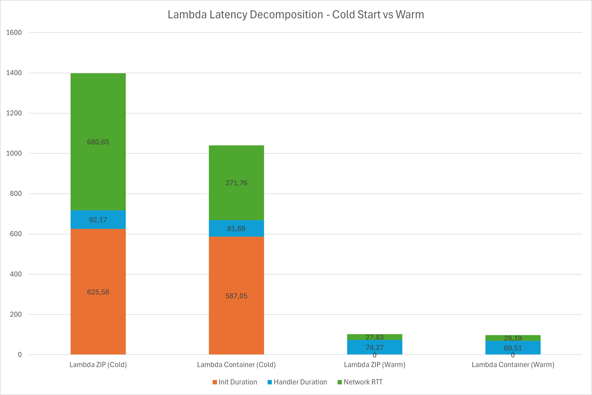
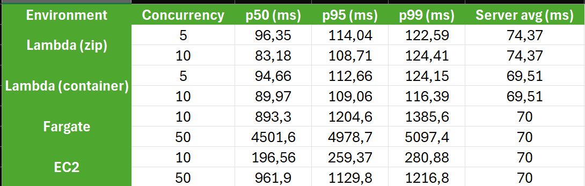
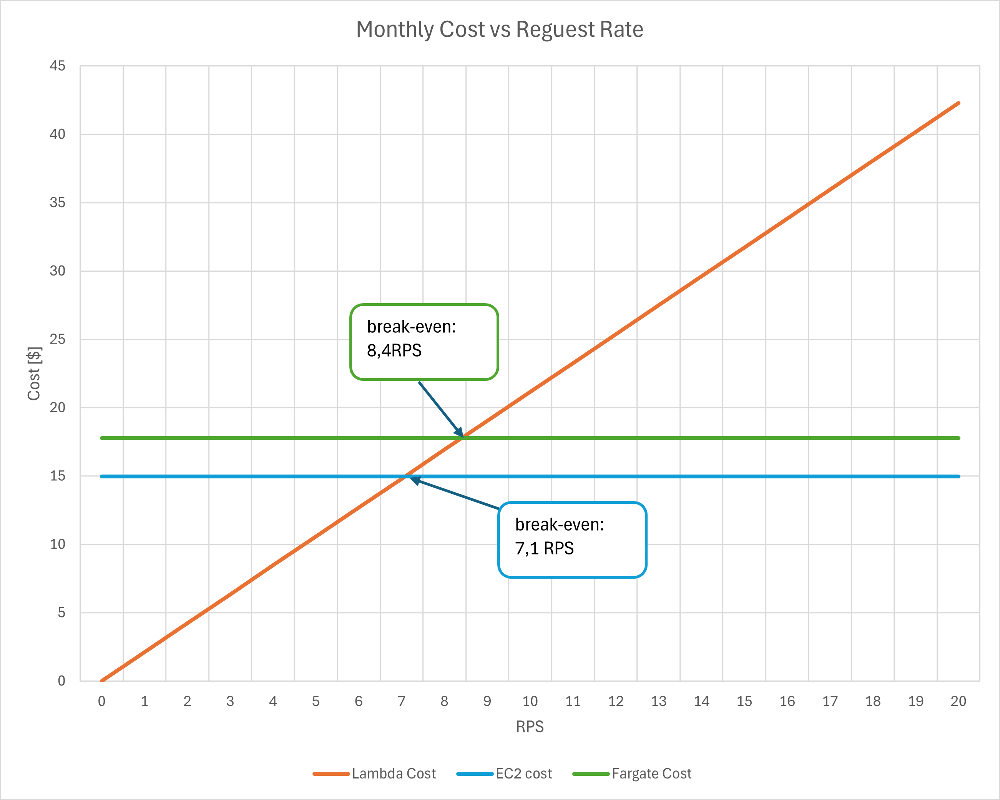

# AWS Cloud Lab — Report
The objective of this lab was to measure and compare the latency and cost of three different AWS execution environments: AWS Lambda (Serverless), ECS Fargate (Containers-as-a-Service), and EC2 (Virtual Machines). All environments ran the same application logic: a compute-heavy brute-force k-nearest-neighbor (k-NN) search over a dataset of 50,000 vectors.

## Assignment 1: Deploy All Environments
I have successfully deployed all environments and verified that they are functional. The terminal output showing the successful responses and matching results from all four endpoints has been saved to results/assignment-1-endpoints.txt.

## Assignment 2: Scenario A — Cold Start Characterization
In this scenario, I measured the "cold start" latency for both AWS Lambda deployment types: Zip and Container. A cold start happens when Lambda has been idle for a long time (over 20 minutes), and AWS must create a new execution environment to handle the request. I sent 30 sequential requests to each endpoint to compare the very first "cold" request with the 29 "warm" requests that followed.
### Latency Decomposition and Network RTT
To understand where the time is spent, I decomposed the total latency into three parts: Init Duration (setting up the environment), Handler Duration (running the code), and Network RTT (network travel and AWS provisioning overhead).
Using the formulas provided:
* For Cold Starts: $Network RTT = Total Latency - Init Duration - Duration$. 
* For Warm Starts: $Network RTT = Total Latency - Duration$.



In my measurements, the Container deployment was faster during a cold start.
* Initialization: The Container's Init Duration (587.05 ms) was shorter than the Zip's (625.58 ms). While Zip files are usually smaller, AWS uses advanced caching to make container starts very efficient in regions like us-east-1.
* Provisioning Overhead: The Zip cold start had a much higher Network RTT (680.65 ms). This suggests that AWS took longer to find and prepare a worker for the Zip package compared to the Container image during this specific test.
* Warm Performance: Once the environments were warm, both performed almost identically.

## Assignment 3: Scenario B — Warm Steady-State Throughput
In this scenario, I tested all four environments under a steady load of 500 requests to measure their performance once they are already "warm". I used two different concurrency levels for each to see how they handle simultaneous traffic. Due to AWS Academy limits, Lambda was tested at c=5 and c=10, while Fargate and EC2 were tested at c=10 and c=50.



### Why Lambda p50 is stable vs. Fargate/EC2 p50 increases
The results show that Lambda's p50 stays very consistent  regardless of whether the concurrency is 5 or 10. This is because Lambda uses a "request-per-instance" model - for every simultaneous request, AWS provides a dedicated execution environment with its own CPU resources. In contrast, Fargate and EC2 p50 latencies increased dramatically when moving from c=10 to c=50. These environments use a "shared-resource" model where a single instance handles all traffic. 
### Difference between Server-side and Client-side Latency
There is a visible gap between the server-side query_time_ms (which is roughly 70ms for the actual calculation) and the client-side p50. This difference is caused by:
* Network RTT: The time taken for the request and response to travel over the internet or AWS network.
* Infrastructure Overhead: Time spent passing through the Application Load Balancer (for Fargate) or the Lambda service layer.
* Queueing Delay: Especially for EC2 and Fargate, the time a request spends waiting in the web server's buffer before the application logic actually starts running.

## Assignment 4: Scenario C — Burst from Zero
This scenario simulates a traffic spike of 200 simultaneous requests arriving after the system has been idle for 20 minutes. It measures how effectively each environment scales or handles sudden pressure. Lambda is restricted to a concurrency of 10, while EC2 and Fargate handle the burst with a single, non-scaling instance at concurrency 50.

### Bimodal Distribution in Lambda
The latency distribution for Lambda (both Zip and Container) is clearly bimodal:
* Warm Cluster (~90-110 ms): The majority of requests (approx. 190 out of 200) were handled quickly. Because our total concurrency was 10, once the 10 environments were initialized, they immediately started processing the remaining queue at "warm" speeds.
* Cold-start Cluster (>1000 ms): A small group of requests (exactly 10, representing the initial concurrent spin-up) experienced high latency due to Init Duration.

### SLO Assessment (p99 < 500ms)
None of the environments met the p99 < 500ms SLO under burst conditions.
* Lambda: Failed because the first 10 requests triggered cold starts, pushing the p95 and p99 well above 1000 ms
* EC2 & Fargate: Failed due to massive queueing. With 200 requests hitting the instance, the CPU could not process them fast enough.

## Assignment 5: Cost at Zero Load
This analysis computes the monthly cost of each environment assuming it stays operational but receives zero traffic.

This analysis computes the monthly cost of each environment assuming it stays operational but receives zero traffic.
* AWS Lambda: As a serverless service, Lambda follows a strict pay-as-you-go model. If there are no invocations, the cost is 0.
* ECS Fargate (0.5 vCPU, 1 GB RAM): 
```
Hourly: (0.5 * 0.04048) + (1 * 0.004445) = $0.024685
Total: $0.024685 * 24 * 30 = $17.77}
```
* EC2: 
```
Hourly: $0.0208
Total: $0.0208 * 24 * 30 = $14.98
```

In this scenario, AWS Lambda is the only environment with a zero idle cost. This is because Lambda is a serverless, event-driven service where charges are only incurred during function execution. For the 18 hours per day of inactivity, the cost remains $0.00.

## Assignment 6: Cost Model, Break-Even, and Recommendation
### Traffic model:
* Peak: 100 RPS for 30 minutes/day
* Normal: 5 RPS for 5.5 hours/day
* Idle: 18 hours/day (0 RPS)

**daily: 279,000 requests**

**monthly: 8,370,000 requests**
### Monthly Cost Calculations
1. AWS Lambda Cost
* Request Cost: (8,370,000 / 1,000,000) * $0.20 = $1.67
* Compute Cost (GB-seconds): 8,370,000 * 0.074s * 0.5 GB = 309,690 GB-s
* Compute Price: 309,690 * $0.0000166667 = $5.16
* Total Lambda Monthly Cost: $6.83
2. EC2 Cost
* Hourly Rate: $0.0208
* Monthly Cost: $0.0208 * 24 hours * 30 days = $14.98
3. AWS Fargate Cost (0.5 vCPU, 1 GB RAM)
* vCPU Cost: 0.5 vCPU * $0.04048 * 24 hours * 30 days = $14.57
* RAM Cost: 1 GB * $0.004445 * 24 hours * 30 days = $3.20
* Total Fargate Monthly Cost: $17.77


### At what average RPS does Lambda become more expensive than Fargate?
* Fargate Monthly Fixed Cost: $17.77
* Lambda Cost per Request: $0.0000002 (Requests) + $0.000000616 (Duration/RAM) = $0.000000816
* Total Requests to Break-even: $17.77 / $0.000000816 = 21,777,000 requests per month
* Break-even RPS: 21,777,000 / (30 * 24 * 3600) = 8.4 RPS




